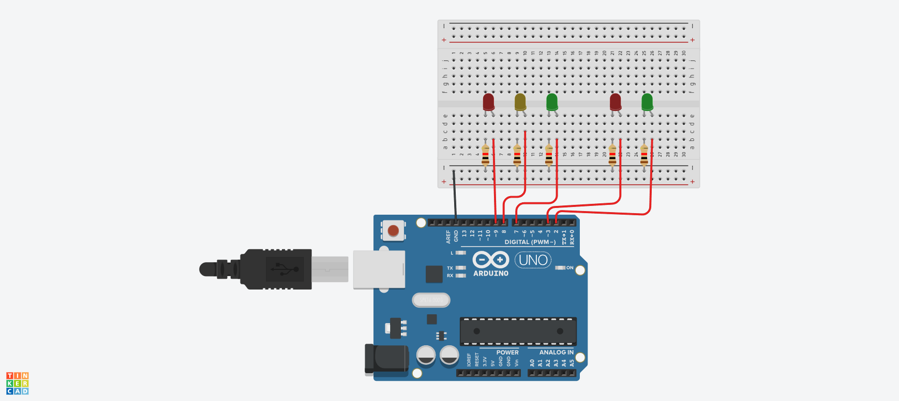
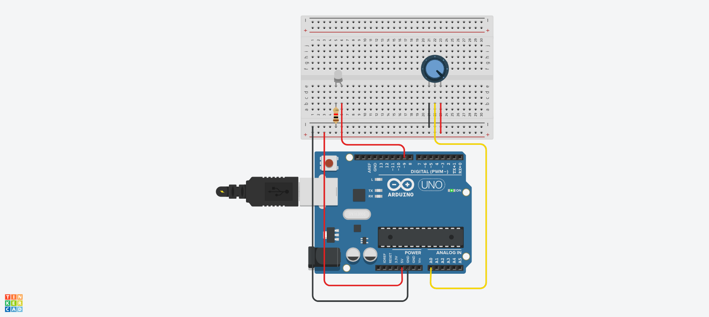
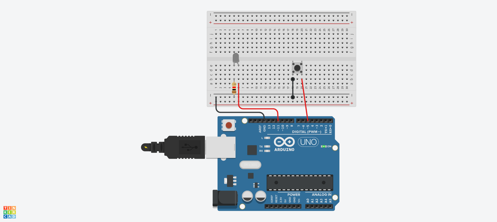

# LED 예 제 1
##LED 깜박이기


## source code

```c
#define LED_BUILTIN 8
void setup() {
  // initialize digital pin LED_BUILTIN as an output.
  pinMode(LED_BUILTIN, OUTPUT);
}

// the loop function runs over and over again forever
void loop() {
  digitalWrite(LED_BUILTIN, HIGH);  // turn the LED on (HIGH is the voltage level)
  delay(1000);                      // wait for a second
  digitalWrite(LED_BUILTIN, LOW);   // turn the LED off by making the voltage LOW
  delay(1000);                      // wait for a second
}

```


##a와b 로 LED 켜고 끄기
```c

void setup()
{
  Serial.begin(9600);
  pinMode(8, OUTPUT);
}
void loop()
{
  if(Serial.available()>0)
  {
    char sData = Serial.read();
    if(sData == 'a')
    {
      digitalWrite(8,HIGH);
    }
    else if(sData == 'b')
    {
      digitalWrite(8, LOW);
    }
  }
}  
  

```


##3개의 LED 켜고 끄기
```c
#define LED1 8
#define LED2 7
#define LED3 6
void setup()
{
  pinMode(LED1, OUTPUT);
  pinMode(LED2, OUTPUT);
  pinMode(LED3, OUTPUT);
}
void loop()
{
  digitalWrite(LED1, HIGH);
  digitalWrite(LED2, HIGH);
  digitalWrite(LED3, HIGH);
  delay(1000);
  digitalWrite(LED1, LOW);
  digitalWrite(LED2, LOW);
  digitalWrite(LED3, LOW);
  delay(1000);
}

```


##버튼으로 led 깜박이기
```c
#define BUTTON 4
#define LED_BLUE 6
#define LED_RED 7
#define DELAY_TIME 80

int state = 0;

void setup(){
  Serial.begin(9600);
  pinMode(BUTTON, INPUT_PULLUP);
  pinMode(LED_BLUE, OUTPUT);
  pinMode(LED_RED, OUTPUT);
  
}

void loop(){
  int buttonValue=!digitalRead(BUTTON);
  
  if(buttonValue == 1)
  {
    state = !state;
    delay(500);
  }
  if(state == 0){
    digitalWrite(LED_BLUE, HIGH);
    digitalWrite(LED_RED, LOW);
    delay(DELAY_TIME);
    digitalWrite(LED_RED, HIGH);
    digitalWrite(LED_BLUE, LOW);
    delay(DELAY_TIME);
  }
  else if(state == 1){
    digitalWrite(LED_BLUE, LOW);
    digitalWrite(LED_RED, LOW);
  }
}


```


##led를 이용한 신호등 구현

```c
#define CAR_LED_RED 9
#define CAR_LED_YELLOW 8
#define CAR_LED_GREEN 7
#define HUMAN_LED_RED 3
#define HUMAN_LED_GREEN 2

void setup() {
  pinMode(CAR_LED_RED, OUTPUT);
  pinMode(CAR_LED_YELLOW, OUTPUT);
  pinMode(CAR_LED_GREEN, OUTPUT);
  pinMode(HUMAN_LED_RED, OUTPUT);
  pinMode(HUMAN_LED_GREEN, OUTPUT);
}
void loop() {
  digitalWrite(CAR_LED_RED, LOW);
  digitalWrite(CAR_LED_YELLOW, LOW);
  digitalWrite(CAR_LED_GREEN, HIGH);
  digitalWrite(HUMAN_LED_RED, HIGH);
  digitalWrite(HUMAN_LED_GREEN, LOW);
  delay(5000);
  digitalWrite(CAR_LED_RED, LOW);
  digitalWrite(CAR_LED_YELLOW, HIGH);
  digitalWrite(CAR_LED_GREEN, LOW);
  digitalWrite(HUMAN_LED_RED, HIGH);
  digitalWrite(HUMAN_LED_GREEN, LOW);
  delay(5000);
  digitalWrite(CAR_LED_RED, HIGH);
  digitalWrite(CAR_LED_YELLOW, LOW);
  digitalWrite(CAR_LED_GREEN, LOW);
  digitalWrite(HUMAN_LED_RED, LOW);
  digitalWrite(HUMAN_LED_GREEN, HIGH);
  delay(2000);
  digitalWrite(HUMAN_LED_GREEN, LOW);
  delay(500);
  digitalWrite(HUMAN_LED_GREEN, HIGH);
  delay(500);
  digitalWrite(HUMAN_LED_GREEN, LOW);
  delay(500);
  digitalWrite(HUMAN_LED_GREEN, HIGH);
  delay(500);
  digitalWrite(HUMAN_LED_GREEN, LOW);
  delay(500);
  digitalWrite(HUMAN_LED_GREEN, HIGH);
  delay(500);
}


```



가변저항을 이용한 스탠드 구현
```c
#define LED 9
#define VR A0

void setup(){
  Serial.begin(9600);
}

void loop(){
  int analogValue = analogRead(VR);
  int analogMapping = map(analogValue, 0, 1023, 0, 255);
  
  analogWrite(LED, analogMapping);
}

```

스위치버튼을 이용한 스탠드 구현
```c
#define SW_PIN 5
#define LED_PIN 11

int newSwValue = 1;
int oldSwValue = 1;
int cnt = 0;

void setup() {
  Serial.begin(9600);
  pinMode(SW_PIN, INPUT_PULLUP);
}

void loop() {
  newSwValue = digitalRead(SW_PIN);

  if(newSwValue != oldSwValue) {
    oldSwValue = newSwValue;
    if(newSwValue == 0) {
      cnt++;
      if(cnt >= 4) cnt = 0;
      Serial.println(newSwValue);
    }
    delay(200);
  }
  if(cnt == 0) analogWrite(LED_PIN, 0);
  else if(cnt == 1) analogWrite(LED_PIN, 50);   
  else if(cnt == 2) analogWrite(LED_PIN, 150);   
  else if(cnt == 3) analogWrite(LED_PIN, 255);   
}

```
