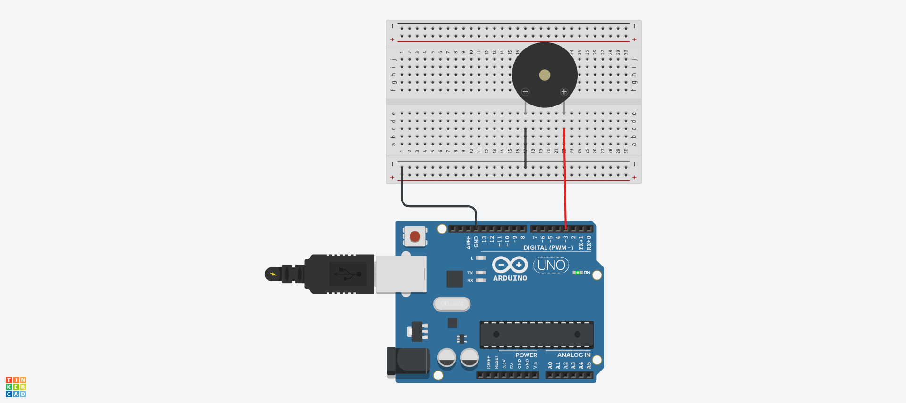
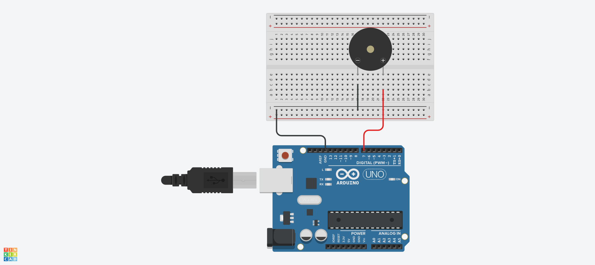

# tone 예제
##도래미파솔 음정 출력

## source code
```c
void setup(){
  pinMode(3, OUTPUT);
}

void loop(){
  tone(7, 262, 1000);
  delay(500);
  tone(7, 294, 1000);
  delay(500);
  tone(7, 330, 1000);
  delay(500);
  tone(7, 349, 1000);
  delay(500);
  tone(7, 392, 1000);
  delay(500);
  tone(7, 440, 1000);
  delay(500);
  tone(7, 494, 1000);
  delay(500);
}

##긴 악보 연주곡

##source code
```c
const int piezo = 7;
char code[] = {'C','D','E','F','G','A','B'};
unsigned int freq[] = {262, 294, 330, 349, 392, 440, 494};
char mData[] = "CCGGAAGpFFEEDCCpGGFFEEDpGGFFEEDpCCGGAAGpFFEEDDCp";
const byte mSize = sizeof(mData);
void setup(){
  pinMode(piezo, OUTPUT);
}

void loop(){
  int playT = 200;
  for(int m = 0; m<mSize; m++){
    for(int k =0; k<7; k++){
      if(mData[m] == code[k]) tone(piezo, freq[k], playT);
    }
    delay(playT);
  }
  noTone(piezo);
  delay(2000);
}
